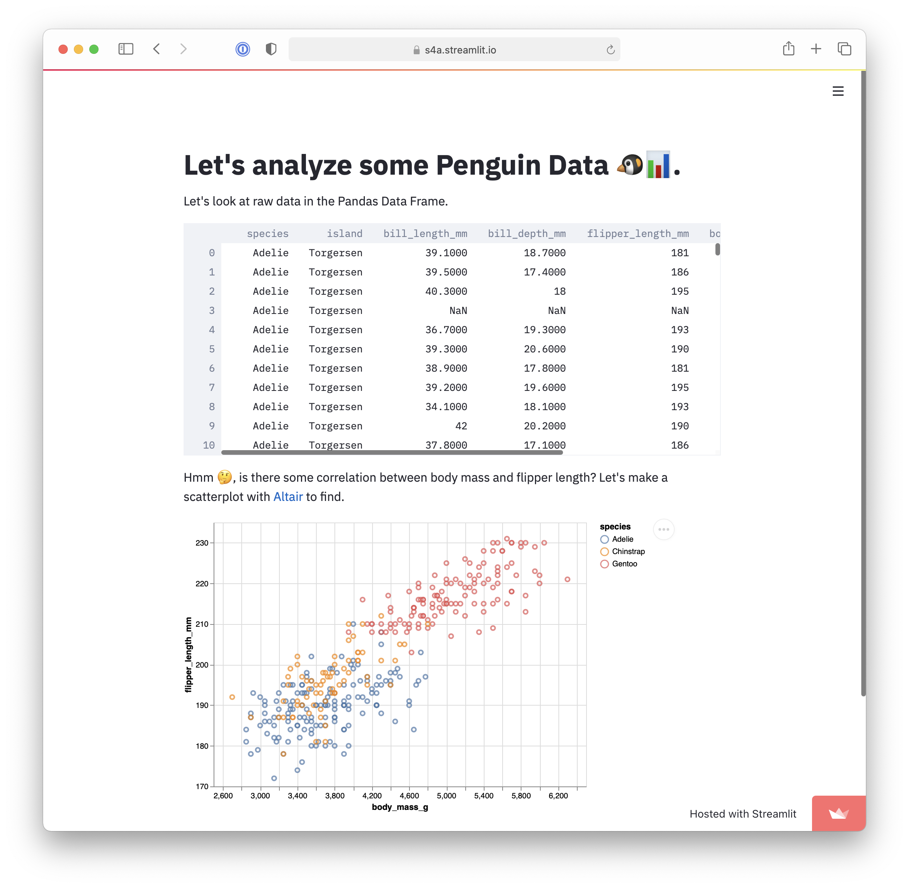

# What's behind Billionaire's 💰💰💰

TODO: Update screenshot

**Overview**: Researchers have compiled a multi-decade database of the super-rich. Building off the Forbes World’s Billionaires lists from 1996-2014, scholars at Peterson Institute for International Economics have added a couple dozen more variables about each billionaire - including whether they were self-made or inherited their wealth. 

We are interested in the rank of billionaires in different years, the distribution of cumulative wealth across country, distribution of billionaires across gender, location, industry, company type, and wealth accural means. 

We achieved these goals through different types of visualization including interactive dataframe, bar chart, map, pie chart, and scatter plot. Users can customize the information of their interest and explore results in multiple interactive methods provided.

## Project Goals
**Our project aims to answer the following five questions using billionaires' data through various interactive visualization tools.**
1. Who are the TOP 10 billionaires and what's their wealth in 1996, 2001, and 2014?
2. How has billionaire's wealth contributed to different economies and how has the wealth distribution changed throughout years?
3. What's the distribution of billionaires in 2014 by the following criteria:
    - Type of the billionaire's wealth
    - Type of the billionaire's business
    - Tegion of the world the billioanire resides
    - Tndustry the billionaire profitted from
4. How is billaionaires' age associated with their wealth in 2014?
5. Given data of year 2014, were the wealth of billionaires inherited or earned? How does that look like by age and wealth?

## Design

TODO: **A rationale for your design decisions.** How did you choose your particular visual encodings and interaction techniques? What alternatives did you consider and how did you arrive at your ultimate choices?

**1. Who are the TOP 10 billionaires and what's their wealth in 1996, 2001, and 2014?**
  - Filter by year: selection box  
  - Present TOP 10 billionaire's information by rank: sorted dataframe (table)
  - Visualize TOP 10 billiaonires' wealth: sorted bar chart with color scales
 
**2. How has billionaire's wealth contributed to different economies and how has the wealth distribution changed throughout years?**
  - Filter by year: selection box
  - Visualize geographical location: world map
  - Show cumulative wealth from billionaires by country: color scale to represent change in wealth worth 

**3.What's the distribution of billionaires in 2014 by different criteria?**
  - Select criteria for distribution: selection box
  - Show distribution by criteria: bar chart
  - Link between criteria and sub-group gender distribution: select bar
  - Show gender distribution in selected bar group: pie chart

**4. How is billionaires' age associated with their wealth in 2014?**
  - Explore relationship between billiaonaire's age and wealth: scatter plot

**5. Given data of year 2014, were the wealth of billionaires inherited or earned? How does that look like by age and wealth?**
  - Show different wealth accural means: color the points in scatter plot
  - Show distribution of wealth accural means by age and wealth worth: selection interval linked to stacked bar chart

## Development
**Responsibility**
- Each member identified variables of interest, coming up with goals together.
- Each member took responsibility for two graphs

**Time Commitment**
- Approximately 10 hours for each member

**Which aspect took the most time?**
- Silvia: think and implement interactions between graphs
- Tina: explore how to use map with Altair and deploy it to Streamlit

## Success Story

TODO:  **A success story of your project.** Describe an insight or discovery you gain with your application that relates to the goals of your project.
**1. Who are the TOP 10 billionaires and what's their wealth in 1996, 2001, and 2014?**
  - TOP 10 billionaires haven't changed a lot in 1996, 2001, and 2014, perhaps because it took time to accumulate wealth.
  - Bill Gates stayed at the TOP 1 position for all three years with his wealth increased by around four times from 1996 to 2014.

**2. How has billionaire's wealth contributed to different economies and how has the wealth distribution changed throughout years.**
    - The majority of cumulative wealth from billionaires aggregates in North America across 1996, 2001, and 2014
    - Cumulative wealth from billiionaires increased significantly in Asia from 1996 to 2014, especially in Russia and China
    - Previously, the wealth aggregated more in western countries, specifically the United States. As time goes on, the economies in Asia grew a lot, making the wealth distribution across country more scattered.

**3. What's the distribution of billionaires in 2014 by different criteria?**
    - Majority of 
4. How is billaionaires' age associated with their wealth
5. Were the wealth of billionaires inherited or earned? How does that look like by age and wealth?

