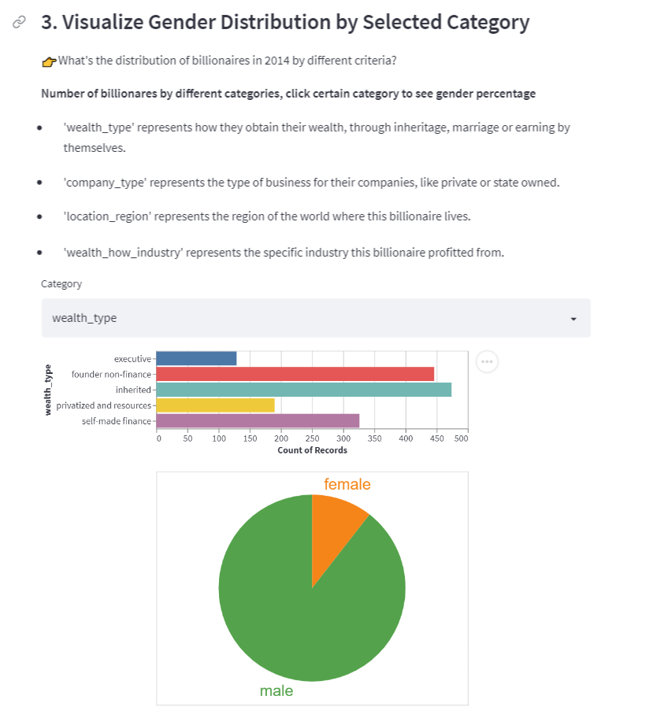

# What's behind Forbes Billionaires' 💰💰💰
**App Screenshots**

**Overview**: Researchers have compiled a multi-decade database of the super-rich. Building off the Forbes World’s Billionaires lists from 1996-2014, scholars at Peterson Institute for International Economics have added a couple dozen more variables about each billionaire - including whether they were self-made or inherited their wealth. 
[(Data Source)](https://corgis-edu.github.io/corgis/csv/billionaires/)

We are interested in the rank of billionaires in different years, the distribution of cumulative wealth across country, distribution of billionaires across gender, location, industry, company type, and wealth accural means. 

We achieved these goals through different types of visualization including interactive dataframe, bar chart, map, pie chart, and scatter plot. Users can customize the information of their interest and explore results in multiple interactive methods provided.

## Project Goals
**Our project aims to answer the following five questions using billionaires' data through various interactive visualization tools.**
1. Who are the TOP 10 billionaires and what's their wealth in 1996, 2001, and 2014?
2. How has billionaire's wealth contributed to different economies and how has the wealth distribution changed throughout years?
3. What's the distribution of billionaires in 2014 by the following criteria:
    - Type of the billionaire's wealth
    - Type of the billionaire's business
    - Region of the world the billioanire resides
    - Industry the billionaire profitted from
4. How is billaionaires' age associated with their wealth in 2014?
5. Given data of year 2014, were the wealth of billionaires inherited or earned? How does that look like by age and wealth?

## Design

**1. Who are the TOP 10 billionaires and what's their wealth in 1996, 2001, and 2014?**
  - Filter by year: selection box  
  - Present TOP 10 billionaire's information by rank: sorted dataframe (table)
  - Visualize TOP 10 billiaonires' wealth: sorted bar chart with color scales
  - *We enable users to focus on top 10 billionaires across years by this design. Table is straightforward to show the rank. We only take 3 columns from the full dataframe to emphasize crucial information: Name of billionaire, their total weath and rank in the list; Using sorted colorful bar chart, we show the wealth of billionaires by their rank and it's helpful to see the wealth gap between top 10 billionaires.*
 
**2. How has billionaire's wealth contributed to different economies and how has the wealth distribution changed throughout years?**
  - Filter by year: selection box (dropdown menu)
  - Visualize geographical location: choropleth map
  - Show cumulative wealth from billionaires by country: different color shades to represent change in wealth worth 
  - *The rationale of using the world map is straightforward as we'd like to present geological information. Here I matched the country information from my dataset with country-code to color the entire country regions. We chose not to use longitute and latitude because by doing so, we could only use circles to represent the country with varying size indicating the difference in wealth worth (aka a bubble map). This is not aesthetically pleasant—using different color shades is more efficient. By selecting different years using the dropdown menu, users are able to detect a direct change in wealth distribution (If our year variable is more "continuous", we'd have used slider rather than dropdown menu and added some color transition effects if possible). The tooltip also allows users to check country names and the original wealth worth.*  

**3.What's the distribution of billionaires in 2014 by different criteria?**
  - Select criteria for distribution: selection box
  - Show distribution by criteria: bar chart
  - Link between criteria and sub-group gender distribution: select bar
  - Show gender distribution in selected bar group: pie chart
  - *Bar chart and pie chart are good tools to show distribution, proportion and allow cross-group comparison. Selection box allow users to slice data by different categories and explore distribution. Link between these two charts enable users to dig dipper when they care about detailed information within certain sub-groups.*

**4. How is billionaires' age associated with their wealth in 2014?**
  - Explore relationship between billiaonaire's age and wealth: scatter plot
  - *Scatter plot is a great if we want to catch any trend/relationship between two continuous variables.*

**5. Given data of year 2014, were the wealth of billionaires inherited or earned? How does that look like by age and wealth?**
  - Show different wealth accural means: color the points in scatter plot
  - Show distribution of wealth accural means by age and wealth worth: selection interval linked to stacked bar chart
  - *We would like to build some interactions between two different plots. Here we choose selection interval as the customized size of selected region allows users to explore inheritance types by age(with the selected region as a vertical rectangle with height covering the wealth worth range), by wealth level (with the selected region as a horizontal rectangle with length covering the age range), or by any combinations of age and wealth level customized by users. The stackbaris a direct way to show the count and proportion of different inheritance types. Pie chart can also achieve that goal, but it seems not fit here as we want to keep the wealth worth axis consistent with the linked scatter plot.*

## Development
**Responsibility**
- Each member identified variables of interest, coming up with goals together.
- Each member took responsibility for two graphs

**Time Commitment**
- Approximately 10 hours for each member

**Which aspect took the most time?**
- Silvia: think and implement interactions between graphs
- Tina: explore how to use map with Altair and deploy it to Streamlit

## Success Story

**1. Who are the TOP 10 billionaires and what's their wealth in 1996, 2001, and 2014?**
- TOP 10 billionaires haven't changed a lot in 1996, 2001, and 2014, perhaps because it took time to accumulate wealth.
- Bill Gates stayed at the TOP 1 position for all three years with his wealth increased by around four times from 1996 to 2014.

**2. How has billionaire's wealth contributed to different economies and how has the wealth distribution changed throughout years.**
- The majority of cumulative wealth from billionaires aggregates in North America across 1996, 2001, and 2014
- Cumulative wealth from billiionaires increased significantly in Asia from 1996 to 2014, especially in Russia and China
- Previously, the wealth aggregated more in western countries, specifically the United States. As time goes on, the economies in Asia grew a lot, making the wealth distribution across country more scattered.

**3. What's the distribution of billionaires in 2014 by gender and other different criteria?**
- Overall and in all subset levels, the proportion of male billionaires are more than 75% comparing with female. 
- In buyside financial industries, including private equity, venture capital and hedge fund, all billionaires are male.
- Among all wealth type, 'inherited' type has the highest number of billionaires and 'non founder financial' type is the second highest.
- Among all company type, 'new' type has the the highest number billionaires.
- Most billionaires live in North American. There's also a lot of billionaires in Europe and Asia.
- Among all industris, most billionaires earn profit from consumer industry. 
    
    
**4. How is billionaires' age associated with their wealth in 2014**
- The majority of Forbes billionaires aged between 40 to 80, indicating that the richest people in the world usually achieve the peak of their wealth at their middle age
- The majority of billionaires are on the bottom half of the wealth worth scale (log), meaning that it may be relative easier to achieve a lower-to-middle wealth level (although still rich) compared to the "super-wealthy" level: only a few are able to make it to the top.
    
    
**5. Given data of year 2014, were the wealth of billionaires inherited or earned? How does that look like by age and wealth?**
- Most billionaires' wealth are not inherited, especially for those who wealth worth is at the lower level on the scale. Wealth inherited from father or third generation becomes more prevelant in upper level of wealth worth. This may imply that by one's own effort, the person is able to accumulate certain amount of wealth, but in order to become one of the TOP richest people, family heritage sometimes may play an important role (although for some of the richest people, their wealth was not inherited—this may have something to do with other factors such as company industry, etc).
- Distribution of inheritance type, in general, is consistent across all age groups: not inherited > father > 3rd generation > 4th generation > 5th generation > spouse/widow.

